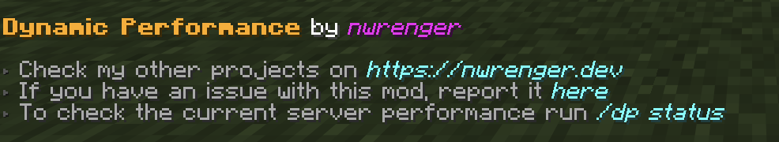
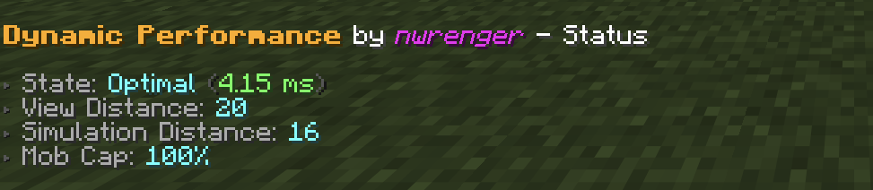

# Dynamic Performance

[](https://modrinth.com/mod/dynamic-performance)
[](https://modrinth.com/mod/dynamic-performance)
[](https://modrinth.com/mod/dynamic-performance)

A lightweight **performance mod** that keeps gameplay close to **vanilla** with adaptive **view distance**, **simulation distance**, and **mob cap** based on the server's **MSPT**.

> Ideal for server owners who want to stay close to vanilla while still having great server performance without disabling gameplay features, forcing restarts, or constantly changing settings by hand.

## Why use this mod?

1. **Automatic lag reduction**:
   Dynamically lowers simulation distance, view distance, and mob caps when needed to keep the server from lagging.
2. **Server-friendly scaling**:
   Uses configurable performance levels, allowing you to control exactly what gets reduced first and how far it may go.
3. **Lightweight and passive**:
   Only checks performance on a configurable interval instead of running heavy logic every tick.
4. **Flexible and Compatible**:
   Works on dedicated servers, in singleplayer, and larger Fabric or NeoForge modded setups.
5. **Visible Performance State**:
   Includes in-game commands for checking the current optimization state.

> **TL;DR**: Keeps your server vanilla and feeling responsive, even during busy moments.

## How it works

Dynamic Performance watches the server's average tick time in milliseconds per tick (MSPT). A healthy Minecraft server targets 20 TPS, which means each tick should stay below 50 ms.

When the configured lag threshold is reached, the mod starts with the first available performance level and continues further through the list if more reductions are needed. When the server has recovered below the recovery threshold, it scales settings back up in reverse order.

If the MSPT stays between the lag and recovery thresholds, no scaling changes are made. At that point, the server is considered stable. See the [Performance States](#performance-states) section for more details.

The scaling order can be set in the configuration file, which is covered in the [Configuration](#configuration) section.

# Installation

After adding mod to your world or server, you should be able to open the about panel, which is fully controllable with the mouse:

```mcfunction
/dp about
```

or

```mcfunction
/dynamicperformance about
```



## Status

The current performance state, MSPT, view distance, simulation distance, and mob cap percentage can be checked with:

```mcfunction
/dp status
```

or

```mcfunction
/dynamicperformance status
```



### Performance States

The following performance states get reported:

- `Optimal`: Server performance is healthy and all configured levels are restored.
- `Stable`: Server performance is between the recovery and lag thresholds.
- `Scaling Down`: Server MSPT is high and Dynamic Performance can still reduce settings.
- `Lagging`: Server MSPT is high, but all configured levels are already at their minimum values.
- `Scaling Up`: Server performance has recovered and Dynamic Performance can restore settings.

## Configuration

A config file is created at:

```text
./config/dynamic-performance.json
```

> After editing the file, **restart the server/game** to apply changes.

Default contents:

```json
{
  "interval": 15,
  "lag_threshold": 45.0,
  "recovery_threshold": 30.0,
  "levels": [
    {
      "type": "SIMULATION_DISTANCE",
      "max": 16,
      "min": 8,
      "increment": 1
    },
    {
      "type": "MOB_CAP_PERCENTAGE",
      "max": 100,
      "min": 75,
      "increment": 5
    },
    {
      "type": "SIMULATION_DISTANCE",
      "max": 8,
      "min": 5,
      "increment": 1
    },
    {
      "type": "MOB_CAP_PERCENTAGE",
      "max": 75,
      "min": 30,
      "increment": 15
    },
    {
      "type": "VIEW_DISTANCE",
      "max": 20,
      "min": 4,
      "increment": 2
    }
  ]
}
```

> This config keeps the most visible change, view distance, as the last fallback while reducing server-side load earlier through simulation distance and mob spawning.

### Options

- `interval`: How often, in seconds, the server performance is checked and adjusted.
- `lag_threshold`: MSPT value at which scaling down starts.
- `recovery_threshold`: MSPT value below which scaling back up starts.
- `levels`: Ordered scaling rules for view distance, simulation distance, and mob cap percentage.

### Level Types

Supported level types:

- `VIEW_DISTANCE`: Adjusts the server view distance.
- `SIMULATION_DISTANCE`: Adjusts the server simulation distance.
- `MOB_CAP_PERCENTAGE`: Adjusts the mob cap as a percentage of vanilla mob caps.

Each level has:

- `max`: Highest value the mod may restore this setting to.
- `min`: Lowest value the mod may reduce this setting to.
- `increment`: Step size used when scaling up or down.

> The order matters. Scaling down follows the list from top to bottom, while scaling back up follows it from bottom to top.

## Contributing & Issues

I warmly welcome:

- Bug reports
- Feature requests
- Pull requests

Please open issues or PRs on [GitHub](https://github.com/nwrenger/dynamic-performance/issues).

## License

This project is licensed under the **LGPLv3 License**. See [LICENSE](https://github.com/nwrenger/dynamic-performance/blob/main/LICENSE) for details.
