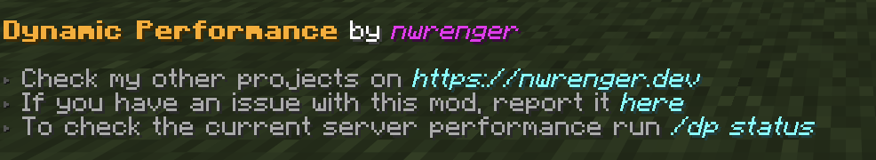
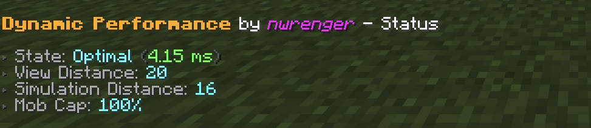
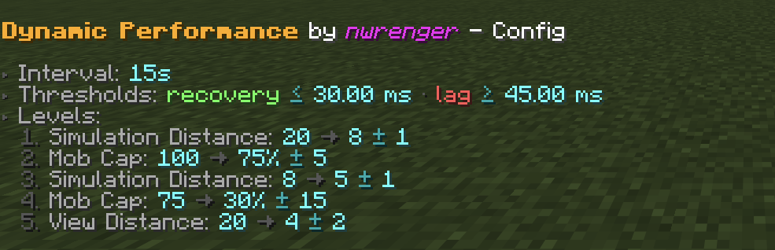

# Dynamic Performance

[](https://modrinth.com/mod/dynamic-performance)
[](https://modrinth.com/mod/dynamic-performance)
[](https://modrinth.com/mod/dynamic-performance)

A **vanilla-preserving** and **lightweight** performance mod that **dynamically** adjusts **view distance**, **simulation distance**, and the **mob cap** based on the server's **load**.

> Ideal for server owners who want to keep the best possible playing experience even on weaker hardware.

## Why use this mod?

1. **Dynamic Scaling**:
   By checking the server's MSPT (milliseconds per tick), it dynamically scales to ideal settings, ensuring that the server runs as well as it is able to.
2. **Extensible Configuration**:
   The kind of scaling, as well as the check interval, is fully configurable for your hardware's capabilities.
3. **Flexible and Compatible**:
   This mod works in singleplayer and multiplayer, supports Fabric and NeoForge, and is compatible with all other performance mods.
4. **Comprehensible**:
   By using the provided commands to check the current server status, review the active config, and reload config changes, it's easy to understand exactly what's going on.

## How it works

Dynamic Performance monitors the current MSPT by checking it every 15 seconds or so. For further information, consult the [Configuration](#configuration) section.

> Side Info: A healthy server targets 20 TPS (ticks per second) and, therefore, 50 MSPT at max. So, the lag threshold should be around this value.

Furthermore, if the MSPT exceeds the lag threshold, the server starts scaling down as configured in the performance levels until it no longer exceeds the threshold. The same is true for recovery: If the MSPT is lower than the recovery threshold, the server starts scaling up based on the mentioned levels, now in reverse.

If the MSPT stays between the lag and recovery thresholds, no scaling changes are made. The server is then considered stable. See the [Performance States](#performance-states) section for more details.

## Installation

After adding the mod to your world or server, you should be able to open the about panel, which is fully controllable with the mouse:

```mcfunction
/dp about
```

or

```mcfunction
/dynamicperformance about
```



## Status

The current performance state, MSPT, view distance, simulation distance, and mob cap percentage can be checked with:

```mcfunction
/dp status
```

or

```mcfunction
/dynamicperformance status
```



### Performance States

The following performance states are reported:

- `Optimal`: All configured levels are restored.
- `Stable`: MSPT is between the recovery and lag thresholds.
- `Scaling Down`: MSPT is high and settings can still be reduced.
- `Lagging`: MSPT is high, but all configured levels are already at their minimum values.
- `Scaling Up`: Settings are being restored.

## Configuration

A config file is created at:

```text
./config/dynamic-performance.json
```

Default contents:

```json
{
  "interval": 15,
  "lag_threshold": 45.0,
  "recovery_threshold": 30.0,
  "levels": [
    {
      "type": "SIMULATION_DISTANCE",
      "max": 16,
      "min": 8,
      "increment": 1
    },
    {
      "type": "MOB_CAP_PERCENTAGE",
      "max": 100,
      "min": 75,
      "increment": 5
    },
    {
      "type": "SIMULATION_DISTANCE",
      "max": 8,
      "min": 5,
      "increment": 1
    },
    {
      "type": "MOB_CAP_PERCENTAGE",
      "max": 75,
      "min": 30,
      "increment": 15
    },
    {
      "type": "VIEW_DISTANCE",
      "max": 20,
      "min": 4,
      "increment": 2
    }
  ]
}
```

> This config keeps the most visible change, view distance, as the last fallback while reducing server-side load earlier through simulation distance and mob spawning.

### Options

- `interval`: How often, in seconds, the server performance is checked and adjusted.
- `lag_threshold`: MSPT value at which scaling down starts.
- `recovery_threshold`: MSPT value at or below which scaling back up starts.
- `levels`: Ordered scaling rules for view distance, simulation distance, and mob cap percentage.

### Level Types

Supported level types:

- `VIEW_DISTANCE`: Adjusts the server view distance.
- `SIMULATION_DISTANCE`: Adjusts the server simulation distance.
- `MOB_CAP_PERCENTAGE`: Adjusts the mob cap as a percentage of vanilla mob caps.

Each level has:

- `max`: Highest value the mod may restore this setting to.
- `min`: Lowest value the mod may reduce this setting to.
- `increment`: Step size used when scaling up or down.

> The order matters. Scaling down follows the list from top to bottom, while scaling back up follows it from bottom to top.

### Active Configuration

The active configuration can be reviewed in-game with:

```mcfunction
/dp config
```

or

```mcfunction
/dynamicperformance config
```



> The screenshot shows the default config listed above.

### Reload

After editing the config file, apply changes without restarting by running:

```mcfunction
/dp reload
```

or

```mcfunction
/dynamicperformance reload
```

> If the config is invalid, the command reports the error and keeps the previous valid config active.

## Contributing & Issues

I warmly welcome:

- Bug reports
- Feature requests
- Pull requests

Please open issues or PRs on [GitHub](https://github.com/nwrenger/dynamic-performance/issues).

## License

This project is licensed under the **LGPLv3 License**. See [LICENSE](https://github.com/nwrenger/dynamic-performance/blob/main/LICENSE) for details.
